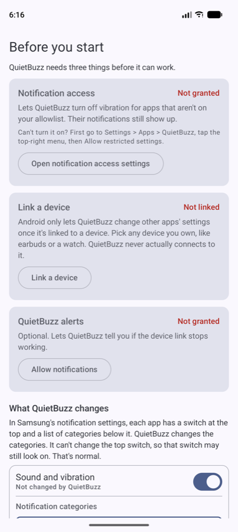
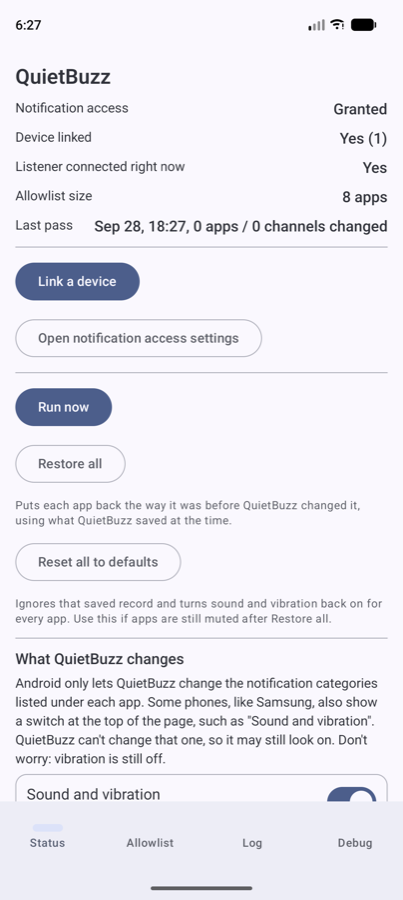
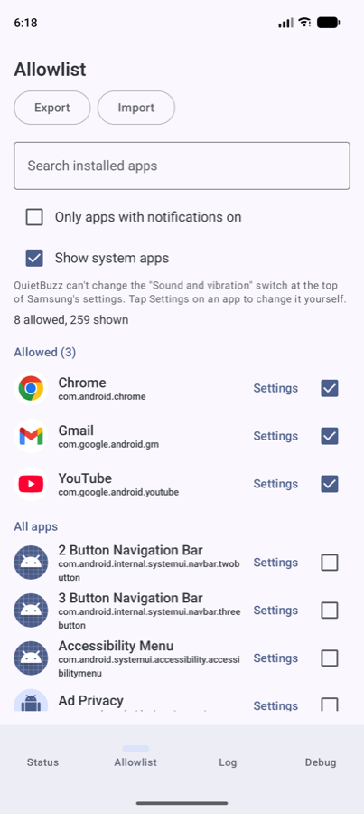
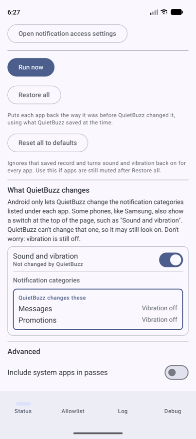
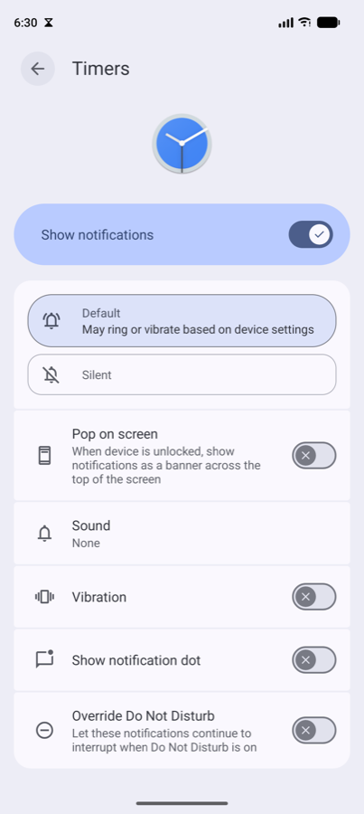
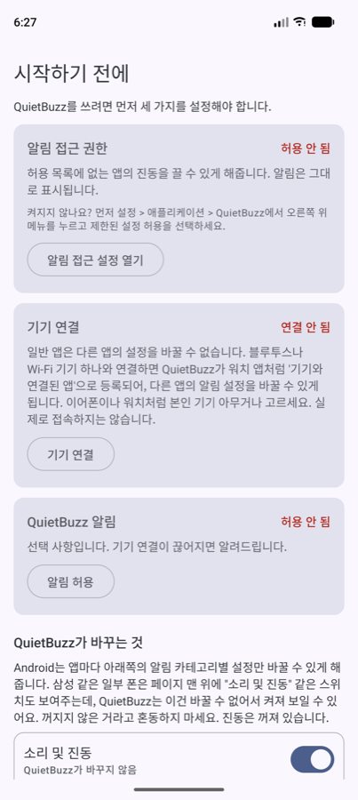
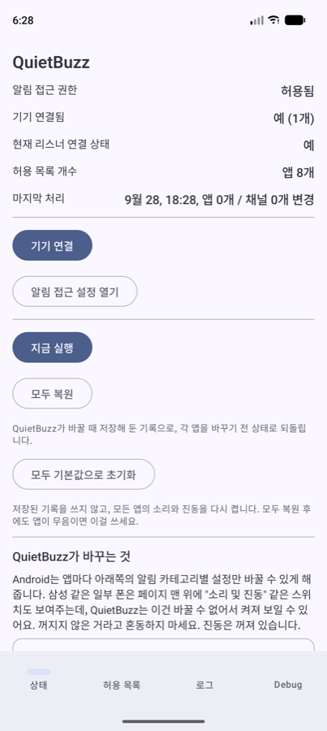
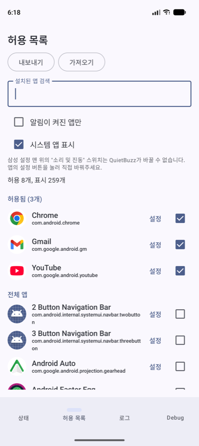
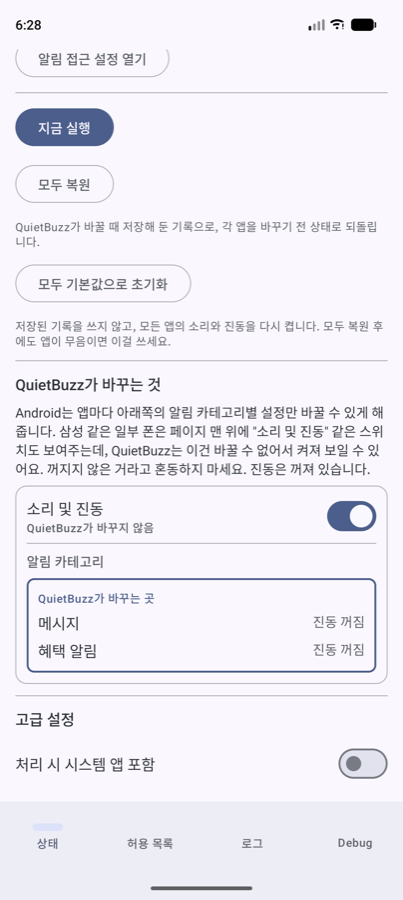
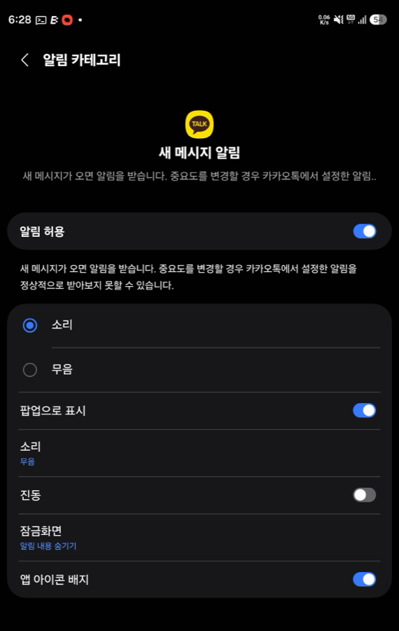

# QuietBuzz

[English](#english) | [한국어](#한국어) | [Website](https://wonjoonseol-ws.github.io/quietbuzz/) | [Download](https://github.com/wonjoonSeol-WS/quietbuzz/releases/latest)

## English

Keep your phone in vibrate mode, and only the apps you pick will buzz. Every other app's notifications still show up, just without vibration. No Do Not Disturb needed.

Works on Android 13 and later. Tested on a Samsung Galaxy Z Fold 8.

  
  
  

### Install

1. On your phone, download the APK from [Releases](https://github.com/wonjoonSeol-WS/quietbuzz/releases/latest) and open it.
2. Go to **Settings > Apps > QuietBuzz**, tap the top-right menu, then **Allow restricted settings**.
3. Open QuietBuzz and follow the first screen: turn on notification access and link a device.
4. Pick the apps that should still vibrate in the **Allowlist** tab, then tap **Run now**.

### Buttons

- **Run now**: turns off vibration for every app not on your allowlist.
- **Restore all**: puts each app back the way it was before QuietBuzz changed it, using what QuietBuzz saved at the time.
- **Reset all to defaults**: ignores that saved record and turns sound and vibration back on for every app. Use it if apps are still muted after Restore all (records saved by early versions can be wrong).
- **Allowlist**: checking an app turns its vibration back on right away. Unchecking turns it off.

### Good to know

- Sound follows your phone's ringer mode. In vibrate mode no app makes sound. In sound mode every app does.
- Android only lets QuietBuzz change the **notification categories** listed under each app. So QuietBuzz turns off vibration for every item under App notifications > Notification categories. Some phones, like Samsung, also show a switch at the top of the page (**Sound and vibration**). QuietBuzz can't change that one, so it may still look on. Don't worry: vibration is still off.
- New apps are handled automatically when you install them.
- Why link a device? Normal apps can't change other apps' settings. Linking one Bluetooth or Wi-Fi device registers QuietBuzz as a linked-device app, like a smartwatch app, which Android allows to change other apps' notification settings. QuietBuzz never actually connects to the device.

### How to check it worked

Open **Settings > Apps > (an app) > Notifications**, then tap one of its categories. **Vibration** should be off. This is the page QuietBuzz changes, not the switch at the top.

  
  

More detail: [Technical notes](docs/TECHNICAL.md)

## 한국어

폰을 진동 모드로 두면, 직접 고른 앱만 진동합니다. 나머지 앱의 알림도 그대로 표시되고, 진동만 꺼집니다. 방해 금지 모드는 필요 없습니다.

Android 13 이상에서 동작합니다. 삼성 갤럭시 Z 폴드 8에서 테스트했습니다.

  
  
  

### 설치

1. 폰에서 [Releases](https://github.com/wonjoonSeol-WS/quietbuzz/releases/latest)의 APK를 내려받아 여세요.
2. **설정 > 애플리케이션 > QuietBuzz**에서 오른쪽 위 메뉴를 누르고 **제한된 설정 허용**을 선택하세요.
3. QuietBuzz를 열고 첫 화면의 안내대로 알림 접근 권한을 켜고 기기를 연결하세요.
4. **허용 목록** 탭에서 계속 진동할 앱을 고르고 **지금 실행**을 누르세요.

### 버튼

- **지금 실행**: 허용 목록에 없는 모든 앱의 진동을 끕니다.
- **모두 복원**: QuietBuzz가 바꿀 때 저장해 둔 기록으로, 각 앱을 바꾸기 전 상태로 되돌립니다.
- **모두 기본값으로 초기화**: 저장된 기록을 쓰지 않고, 모든 앱의 소리와 진동을 다시 켭니다. 모두 복원 후에도 앱이 무음이면 이걸 쓰세요 (초기 버전이 저장한 기록은 틀릴 수 있습니다).
- **허용 목록**: 앱을 체크하면 바로 진동이 돌아오고, 해제하면 바로 꺼집니다.

### 알아두면 좋은 점

- 소리는 폰의 벨소리 모드를 따릅니다. 진동 모드에서는 어떤 앱도 소리를 내지 않고, 소리 모드에서는 모든 앱이 소리를 냅니다.
- Android는 앱마다 아래쪽의 **알림 카테고리**별 설정만 바꿀 수 있게 해줍니다. 그래서 QuietBuzz는 앱 알림 > 알림 카테고리의 세부 항목들에서 진동을 모두 끕니다. 삼성 같은 일부 폰은 페이지 맨 위에 **소리 및 진동** 스위치도 있는데, QuietBuzz는 이건 바꿀 수 없어서 켜져 보일 수 있어요. 꺼지지 않은 거라고 혼동하지 마세요. 진동은 꺼져 있습니다.
- 새로 설치한 앱은 자동으로 처리됩니다.
- 왜 기기를 연결하나요? 일반 앱은 다른 앱의 설정을 바꿀 수 없습니다. 블루투스나 Wi-Fi 기기 하나와 연결하면 QuietBuzz가 워치 앱처럼 '기기와 연결된 앱'으로 등록되어, 다른 앱의 알림 설정을 바꿀 수 있게 됩니다. 연결한 기기에 실제로 접속하지는 않습니다.

### 잘 적용됐는지 확인하기

**설정 > 애플리케이션 > (앱) > 알림**에서 **알림 카테고리** 중 하나를 누르세요. **진동**이 꺼져 있으면 됩니다. QuietBuzz가 바꾸는 곳은 맨 위 스위치가 아니라 이 화면입니다.

  
  

자세한 내용: [Technical notes](docs/TECHNICAL.md) (영어)
